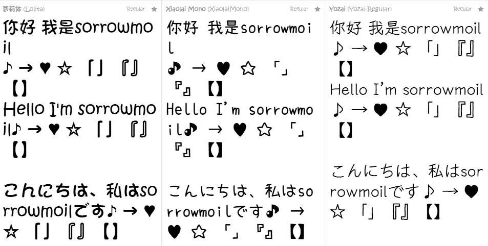
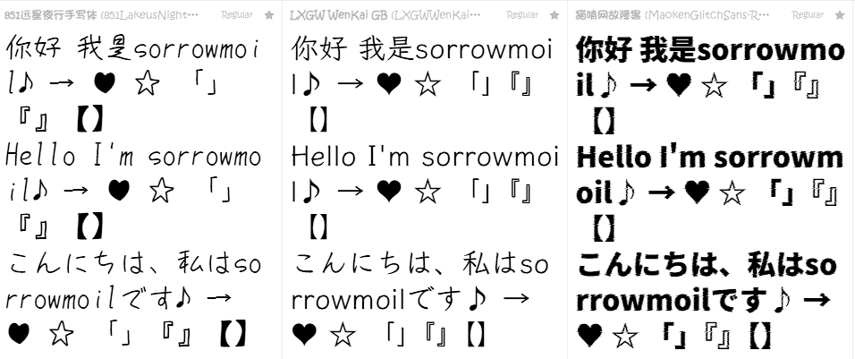
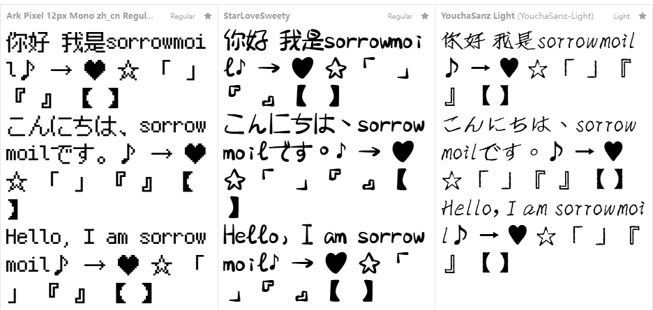

<div align="center">

[](./readme.md)
[](./readme_jp.md)

</div>

<div align="center">

# 🎀 sorrowmoil MoeFont Archive

> A multi-generation moe TMP font asset archive for XUnity.AutoTranslator  
> Providing independently built moe-style Chinese localization font assets for each Unity/TMP generation.

[](.)
[](.)

</div>

---

# 🖼️ Font Preview

Unified rendering test of all fonts currently in the repository.

Test content includes:

- Chinese
- English
- Japanese
- Unicode special symbols

Used to demonstrate actual glyph appearance and stylistic differences across fonts in XUnity/TMP environments.

<div align="center">





</div>

---

# 📚 Table of Contents

- [📖 Terminology](#-terminology)
- [✨ Features](#-features)
- [🎯 Supported Unity Generations](#-supported-unity-generations)
- [🖼️ Font Preview](#️-font-preview)
- [🖋️ Included Fonts](#️-included-fonts)
- [⚙️ Build Configuration](#️-build-configuration)
- [🔄 Compatibility Notes](#-compatibility-notes)
- [🚀 Usage](#-usage)
- [⚠️ Important Notes](#️-important-notes)
- [📜 License](#-license)

---

# 📖 Terminology

> In this document, **TMP** stands for **TextMesh Pro**.  
> **TMP Font Asset** = TextMeshPro Font Asset.

---

# ✨ Features

This repository provides pre-built TMP font assets independently crafted for different Unity/TMP generations, targeting Unity game localization (Chinese) environments.

All assets strive to maintain consistency with the corresponding era's editor, TMP serialization structures, and resource formats to minimize cross-generation compatibility issues.

<details>
<summary><b>📦 Expand for full feature list</b></summary>

- Each Unity generation uses its corresponding TMP version for independent baking and packaging  
- No unified generation scheme; actively avoids cross-generation compatibility problems  
- All resources are structurally organized and ready for localization use  
- Primarily focused on XUnity.AutoTranslator use cases  
- Balances font compatibility needs for both older and newer generation Unity games

</details>

---

# 🎯 Supported Unity Generations

> The versions below indicate the build environment for the font assets, not merely a runtime compatibility range.  
> See individual Release notes for specific build version numbers.

| Unity Generation | 5.x | 2017 | 2018 | 2019 | 2020 | 2021 | 2022 | 2023 | 6000 |
|------------------|------|------|------|------|------|------|------|------|------|
| Support Status  | ⚠️   | ⚠️   |   ✅   |   ✅   |   ✅   |   ✅   |   ✅   |   ✅   |   ✅   |

> ⚠️ Unity 5.x 2017 compatibility is not guaranteed (see [Compatibility Notes](#-compatibility-notes))

---

# 🖋️ Included Fonts

TMP font assets have been prepared for the following moe fonts across all supported generations:

- **Lolita**
- **Yozai**
- **Xiaolai**
- **851LakeusNightWriting-Regular**
- **LXGWWenKaiGB-Regular**
- **maokenwanguzhanhei**
- **Ark Pixel 12px Mono**
- **StarLoveSweety**
- **StarLoveSweety**
---

# ⚙️ Build Configuration

<details>
<summary><b>🔧 Click to expand build parameters</b></summary>

All fonts are built following approximate specifications:

- SDF32  
- Kerning Enabled  
- Fast Mode  
- 8192 × 8192 Atlas  
- Original assets with 40,000+ characters  
- Multi-generation independent baking  
- **LZ4 Compression** (applied across all generations, replacing previous LZMA; disk usage has increased accordingly)  
- ~~**Multi Atlas** (enabled for Unity 2021 and above)~~
> <I>Tests indicate that after enabling **Multi Atlas**, translation loss occurs in the game. </I>

In addition:

> Each Unity generation is built using the TMP version corresponding to that era.

This approach primarily aims to reduce:

- Font Asset serialization differences
- TMP data structure changes
- Unity resource compatibility issues
- Cross-generation font anomalies

</details>

---

# 🔄 Compatibility Notes

<details>
<summary><b>⚠️ Special Note on Unity 5.x 2017 Generation</b></summary>

The Unity 5.x 2017 font assets are built based on **5.2.0f** and **2017.1.0b2**. However, due to the lack of a verifiable Unity 5.x 2017 game environment for testing, **their compatibility is not guaranteed**.  
You are advised to test them yourself if possible and provide feedback.

</details>

---

<details>
<summary><b>📉 Compatibility Between Older and Newer TMP Generations</b></summary>

Generally:

- ✅ Older generation TMP font assets can be upward compatible with newer Unity games  
- ❌ Newer generation TMP font assets may not be downward compatible with older Unity games

> [!WARNING]
> It is not recommended to forcibly use newer generation TMP font assets in older Unity games.

It is advised to use the TMP font assets closest to the target game's generation.

</details>

---

<details>
<summary><b>⚠️ Special Note on Unity 6000 Generation</b></summary>

The Unity 6000 generation font assets provided in this repository are built using a **compatibility scheme (Repackage)**, designed to bypass issues that may arise with native builds under very large character sets.  
This scheme has demonstrated higher stability in testing; please refer to `UNITY6000_NOTICE.txt` within the Release for detailed technical information.

> [!IMPORTANT]
> For Unity 6000 games, be sure to use the **6000-specific versions** from this repository.

</details>

---

# 🚀 Usage

Configure the corresponding generation's TMP font assets in XUnity.AutoTranslator's `.ini` file:

```ini
OverrideFontTextMeshPro=
FallbackFontTextMeshPro=
```

Typically:

* `OverrideFontTextMeshPro` is used for the primary replacement font
* `FallbackFontTextMeshPro` is used as a fallback for missing characters

> 💡 For more configuration details, refer to:  
> [https://github.com/bbepis/XUnity.AutoTranslator](https://github.com/bbepis/XUnity.AutoTranslator)

---

# ⚠️ Important Notes

> Some fonts may not be suitable for serious or high-readability scenarios due to their stylistic nature. Please choose according to the atmosphere of the game.

This repository is oriented more toward:

* Localization compatibility resource archiving
* TMP historical version preservation
* Unity multi-generation compatibility solutions
* Moe-style Chinese localization font organization

It is not a long-term maintenance project.

---

# 📜 License

Font copyrights belong to the original font authors.

This repository provides only:

* TMP font asset builds
* Multi-generation compatibility organization
* Unity/TMP generation-specific archiving

It does not grant any license to the original fonts.

---

<div align="center">

Preserving moe font compatibility across Unity generations.  
Made with 💖 by sorrowmoil

</div>